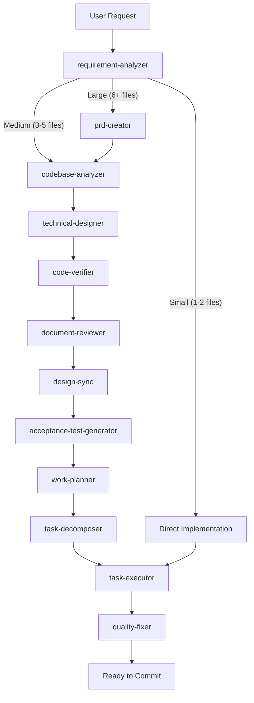
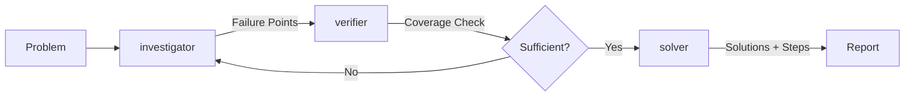
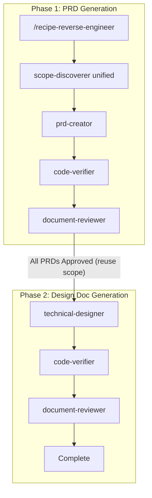

# Claude Code Workflows 🚀

[](https://claude.ai/code)
[](https://github.com/shinpr/claude-code-workflows)
[](https://opensource.org/licenses/MIT)
[](https://github.com/shinpr/claude-code-workflows/pulls)

**End-to-end development workflows for Claude Code that produce code aligned with design docs and tests.** Specialized agents handle requirements, design, implementation, and quality checks, so what you get is code that actually passes its tests and matches its design docs.

---

## ⚡ Quick Start

### Which plugin should I start with?

| Your work | Install |
|---|---|
| Backend, APIs, CLI tools, or general programming | `dev-workflows` |
| React / TypeScript frontend | `dev-workflows-frontend` |
| Full-stack (backend + React) | `dev-workflows-fullstack` (single plugin, replaces installing both) |
| You already have your own orchestration and just want the rules | `dev-skills` (skills only, see [Skills only](#skills-only)) |

### Common setup

```bash
# 1. Start Claude Code
claude

# 2. Add the marketplace
/plugin marketplace add shinpr/claude-code-workflows
```

### Install and start building

```bash
# Backend or general
/plugin install dev-workflows@claude-code-workflows
/reload-plugins
/recipe-implement <your feature>

# Frontend
/plugin install dev-workflows-frontend@claude-code-workflows
/reload-plugins
/recipe-front-design <your feature>

# Fullstack (single plugin)
/plugin install dev-workflows-fullstack@claude-code-workflows
/reload-plugins
/recipe-fullstack-implement "Add user authentication with JWT + login form"

# Or execute from an existing fullstack work plan
/recipe-fullstack-build
```

The fullstack recipes create separate Design Docs per layer (backend + frontend), verify cross-layer consistency via design-sync, and route tasks to the appropriate executor based on filename patterns. See [Fullstack Workflow](#fullstack-workflow) for details.

> **Migration notice:** `recipe-fullstack-*` recipes are available from `dev-workflows-fullstack`, not `dev-workflows`. If you do fullstack work, install only `dev-workflows-fullstack`.

### Optional add-ons

These optional plugins cover adjacent stages in the workflow:

- [claude-code-discover](https://github.com/shinpr/claude-code-discover): turns feature ideas into evidence-backed PRDs.
- [metronome](https://github.com/shinpr/metronome): detects shortcut-taking behavior and nudges Claude to proceed step by step.
- [linear-prism](https://github.com/shinpr/linear-prism): turns requirements into structured Linear tasks. Validates before decomposing, so downstream design starts clean.
- [pr-review](https://github.com/shinpr/pr-review-skill): reviews GitHub PRs with Claude Code or Codex reviewers on deterministic PR snapshots, repo-specific quality criteria, and severity-gated posting with approval.

```bash
/plugin install discover@claude-code-workflows
/plugin install metronome@claude-code-workflows
/plugin install linear-prism@claude-code-workflows
/plugin install pr-review@claude-code-workflows
```

### Grok compatibility

[Grok Workflows](https://github.com/shinpr/grok-workflows) runs Claude Code Workflows largely as-is on Grok. Its small, always-on mapping skill covers the remaining runtime differences in tool names, agent identifiers, and progress tracking. The same workflows run with little additional context.

Grok provides a faster, lower-cost runtime for Claude Code Workflows without requiring a separate port or duplicated workflow definitions.

### Skills only

If you already have your own orchestration (custom prompts, scripts, CI-driven loops) and want only the best-practice guides, use `dev-skills`. If you want Claude to plan, execute, and verify end-to-end, install `dev-workflows`.

- Minimal context footprint (no agents or recipe skills loaded)
- Drop-in best practices without changing your workflow
- Works as a ruleset layer for your own orchestrator

> **Do not install alongside dev-workflows, dev-workflows-frontend, or dev-workflows-fullstack.** Duplicate skills will be silently ignored. See [details below](#warning-duplicate-skills).

```bash
# Install skills-only plugin
/plugin install dev-skills@claude-code-workflows
```

Skills auto-load when relevant. `coding-principles` activates during implementation, `testing-principles` during test writing, etc.

**Switching between plugins:**

```bash
# dev-skills -> dev-workflows
/plugin uninstall dev-skills@claude-code-workflows
/plugin install dev-workflows@claude-code-workflows

# dev-workflows -> dev-skills
/plugin uninstall dev-workflows@claude-code-workflows
/plugin install dev-skills@claude-code-workflows
```

<a id="warning-duplicate-skills"></a>

> **Warning:** dev-skills and dev-workflows / dev-workflows-frontend / dev-workflows-fullstack share the same skills. Installing more than one of them makes skill descriptions appear multiple times in the system context. Claude Code limits skill descriptions to ~2% of the context window. Exceeding this limit causes skills to be silently ignored. For fullstack work, install only `dev-workflows-fullstack` (do not install it alongside `dev-workflows` or `dev-workflows-frontend`).

---

## 🔧 How It Works

### The Workflow



This figure shows how a request is routed by size (small / medium / large). Larger work goes through PRD, codebase analysis, and design before reaching implementation. Smaller work skips ahead.

### The Diagnosis Workflow



The diagnosis flow loops between investigator and verifier until path coverage is sufficient, then hands off to solver for tradeoff analysis.

### The Reverse Engineering Workflow



Reverse engineering runs in two phases. PRDs come first (one per discovered feature), then Design Docs reuse the scope without re-discovering it.

### What Happens Behind the Scenes

1. **Analysis.** requirement-analyzer determines task complexity and picks the workflow.
2. **Codebase Understanding.** codebase-analyzer scans existing modules and dependencies before design (auth flows, schema definitions, dependency graph).
3. **Planning.** PRD, UI Spec, Design Doc, and work plan are generated based on complexity.
4. **Execution.** Specialized agents implement the plan autonomously.
5. **Quality.** Tests run, types check, errors get fixed.
6. **Review.** Implementation is verified against design docs.
7. **Done.** Reviewed, tested, ready to commit.

Each phase runs in a fresh agent context, so earlier steps don't bloat the context or interfere with later decisions.

---

## ⚡ Workflow Recipes

All workflow entry points use the `recipe-` prefix to distinguish them from knowledge skills. Type `/recipe-` and use tab completion to see all available recipes.

### Backend & General Development (dev-workflows)

| Recipe | Purpose | When to Use |
|--------|---------|-------------|
| `/recipe-implement` | End-to-end feature development | New features, complete workflows |
| `/recipe-task` | Execute single task with precision | Bug fixes, small changes |
| `/recipe-design` | Create design documentation | Architecture planning |
| `/recipe-plan` | Generate work plan from design | Planning phase |
| `/recipe-prepare-implementation` | Verify implementation readiness and resolve gaps | Pre-build check that the work plan is implementable |
| `/recipe-build` | Execute from existing task plan | Resume implementation |
| `/recipe-review` | Verify code against design docs | Post-implementation check |
| `/recipe-diagnose` | Investigate problems and derive solutions | Bug investigation, root cause analysis |
| `/recipe-reverse-engineer` | Generate PRD/Design Docs from existing code | Legacy system documentation, codebase understanding |
| `/recipe-add-integration-tests` | Add integration/E2E tests to existing code | Test coverage for existing implementations |
| `/recipe-update-doc` | Update existing design documents with review | Spec changes, review feedback, document maintenance |

For fullstack recipes, install `dev-workflows-fullstack` and use `/recipe-fullstack-implement` or `/recipe-fullstack-build`.

### Frontend Development (dev-workflows-frontend)

The frontend plugin adds React-specific agents (component architecture, Testing Library, TypeScript-first quality checks) and UI Spec generation from optional prototype code.

| Recipe | Purpose | When to Use |
|--------|---------|-------------|
| `/recipe-front-design` | Create UI Spec + frontend Design Doc | React component architecture, UI Spec |
| `/recipe-front-plan` | Generate frontend work plan | Component breakdown planning |
| `/recipe-front-build` | Execute frontend task plan | Resume React implementation |
| `/recipe-front-adjust` | Adjust an already-implemented UI with MCP-driven verification | Visual tweaks, component refinements that need design-source comparison |
| `/recipe-front-review` | Verify code against design docs | Post-implementation check |
| `/recipe-task` | Execute single task with precision | Component fixes, small updates |
| `/recipe-diagnose` | Investigate problems and derive solutions | Bug investigation, root cause analysis |
| `/recipe-update-doc` | Update existing design documents with review | Spec changes, review feedback, document maintenance |

> **Tip:** Both plugins share `/recipe-task`, `/recipe-diagnose`, and `/recipe-update-doc`. `/recipe-update-doc` auto-detects the document's layer. If your project has frontend Design Docs, the frontend plugin is needed to update them. For reverse engineering, use `/recipe-reverse-engineer` with the fullstack option to generate both backend and frontend Design Docs in a single workflow.

---

## 📦 Specialized Agents

The workflow uses specialized agents for each stage of the development lifecycle.

### Shared Agents (Available in Both Plugins)

These agents work the same way whether you're building a REST API or a React app:

| Agent | What It Does |
|-------|--------------|
| **requirement-analyzer** | Figures out how complex your task is and picks the right workflow |
| **codebase-analyzer** | Analyzes existing codebase before design to produce focused guidance for technical-designer |
| **work-planner** | Breaks down design docs into actionable tasks |
| **task-decomposer** | Splits work into small, commit-ready chunks |
| **code-reviewer** | Checks your code against design docs to make sure nothing is missing |
| **document-reviewer** | Reviews single document quality, completeness, and rule compliance |
| **design-sync** | Verifies consistency across multiple Design Docs and detects conflicts |
| **investigator** | Maps execution paths, identifies failure points with causal chains for problem diagnosis |
| **verifier** | Validates failure points, checks path coverage using Devil's Advocate method |
| **solver** | Generates solutions with tradeoff analysis and implementation steps |
| **security-reviewer** | Reviews implementation for security compliance after all tasks complete |

### Backend-Specific Agents (dev-workflows)

| Agent | What It Does |
|-------|--------------|
| **prd-creator** | Writes product requirement docs for complex features |
| **technical-designer** | Plans architecture and tech stack decisions |
| **scope-discoverer** | Discovers functional scope from codebase for reverse engineering |
| **code-verifier** | Validates consistency between documentation and code implementation |
| **acceptance-test-generator** | Creates E2E and integration test scaffolds from requirements |
| **integration-test-reviewer** | Reviews integration/E2E tests for skeleton compliance and quality |
| **task-executor** | Implements backend features with TDD |
| **quality-fixer** | Runs tests, fixes type errors, handles linting (everything quality-related) |
| **rule-advisor** | Picks the best coding rules for your current task |

### Frontend-Specific Agents (dev-workflows-frontend)

| Agent | What It Does |
|-------|--------------|
| **prd-creator** | Writes product requirement docs for complex features |
| **ui-spec-designer** | Creates UI Specifications from PRD and optional prototype code |
| **ui-analyzer** | Reads the project's external-resources file, fetches design / design-system / guideline sources via inherited MCP access, and analyzes existing UI code |
| **technical-designer-frontend** | Plans React component architecture and state management |
| **task-executor-frontend** | Implements React components with Testing Library |
| **code-verifier** | Validates consistency between documentation and code implementation |
| **quality-fixer-frontend** | Handles React-specific tests, TypeScript checks, and builds |
| **rule-advisor** | Picks the best coding rules for your current task |
| **design-sync** | Verifies consistency across multiple Design Docs and detects conflicts |

---

## 📚 Built-in Best Practices

The backend plugin includes proven best practices that work with any language:

- **Coding Principles.** Code quality standards.
- **Testing Principles.** TDD, coverage, test patterns.
- **Implementation Approach.** Design decisions and trade-offs.
- **Documentation Standards.** Clear, maintainable docs.
- **External Resource Context.** Two-tier file recording how to reach resources outside the repo (design source, design system, API schema, IaC, etc.). Available across all three plugins.
- **LLM-Friendly Context.** Clear prompts, handoffs, generated artifacts, and instructions for downstream agents.

These are loaded as skills and automatically applied by agents when relevant.

The frontend plugin has React and TypeScript-specific rules built in.

---

## 🎯 Typical Workflows

### Backend Feature Development

```bash
/recipe-implement "Add user authentication with JWT"

# What you get:
# - PRD, ADR (when applicable), and Design Doc with acceptance criteria
# - Work plan decomposed into commit-ready tasks
# - Backend implementation with TDD, type-checked and linted
# - Code review against the Design Doc before completion
```

### Frontend Feature Development

```bash
/recipe-front-design "Build a user profile dashboard"
# 1. requirement-analyzer determines scale
# 2. External-resource hearing captures design source / design system / visual verification access
# 3. codebase-analyzer + ui-analyzer gather facts in parallel
# 4. Optional prototype code is placed under docs/ui-spec/assets/
# 5. UI Spec captures screen structure, components, and interactions
# 6. Frontend Design Doc inherits UI Spec decisions

# Then run:
/recipe-front-build
# Implements components with Testing Library, handles TypeScript types,
# fixes lint and build errors, and commits per task.
```

**Why UI Spec exists.** Prototypes capture the visual surface, but rarely the loading, error, empty, and partial states that appear during integration.

For example, two components might each handle their own loading state cleanly while the dashboard that combines them has no defined behavior when one is still loading and the other has errored. UI Spec captures these state-x-display matrices and traces them into the Design Doc and test skeletons, so integration breakage is caught early.

### Fullstack Workflow

```bash
/recipe-fullstack-implement "Add user authentication with JWT + React login form"

# What happens:
# 1. requirement-analyzer determines scale
# 2. PRD covers the entire feature (single doc for all layers)
# 3. UI Spec captures the screen structure (with optional prototype)
# 4. Separate Design Docs per layer (backend, frontend)
# 5. design-sync verifies cross-layer consistency
# 6. Work plan composes vertical feature slices
# 7. task-decomposer produces layer-aware task files
# 8. Each task routes to its layer-appropriate executor and quality-fixer
# 9. Vertical slices commit early so integration is verified per phase
```

> **Install `dev-workflows-fullstack`** for fullstack recipes. Tasks are routed based on filename patterns (`*-backend-task-*`, `*-frontend-task-*`). For reverse engineering existing fullstack codebases, use `/recipe-reverse-engineer` with the fullstack option.

### UI Adjustment (Frontend Plugin)

```bash
/recipe-front-adjust "Tighten Card spacing and align action buttons with the design source"

# What you get:
# - External-resource hearing (saved to docs/project-context/external-resources.md, reused across runs)
# - ui-analyzer fetches design source via MCP and proposes a write set for confirmation
# - Edit / MCP-verify / refine loop in the parent session until the result matches the design source
# - quality-fixer-frontend scoped to edited files, then commit per adjustment unit
```

### Quick Fixes (Both Plugins)

```bash
/recipe-task "Fix validation error message"

# Direct implementation with quality checks. Works the same in both plugins.
```

### Code Review

```bash
/recipe-review

# Checks your implementation against design docs and reports gaps.
```

### Problem Diagnosis (Both Plugins)

```bash
/recipe-diagnose "API returns 500 error on user login"

# What happens:
# 1. investigator maps execution paths and identifies failure points
# 2. verifier checks path coverage and validates each failure point
# 3. Re-investigates if coverage is insufficient (up to 2 iterations)
# 4. solver generates solutions with tradeoff analysis
# 5. Presents actionable implementation steps
```

### Reverse Engineering

```bash
/recipe-reverse-engineer "src/auth module"

# What happens:
# 1. Discovers functional scope (user-value + technical) in a single pass
# 2. Generates PRD for each feature unit
# 3. Verifies PRD against actual code
# 4. Reviews and revises until consistent
# 5. Generates Design Docs with code verification
# 6. Produces complete documentation from existing code
#
# Fullstack option: generates both backend and frontend Design Docs per feature unit
```

> If you're working with undocumented legacy code, these commands generate PRD and design docs to make it AI-friendly.
> For a quick walkthrough, see: [How I Made Legacy Code AI-Friendly with Auto-Generated Docs](https://dev.to/shinpr/how-i-made-legacy-code-ai-friendly-with-auto-generated-docs-4353)

---

## 📂 Repository Structure

```
claude-code-workflows/
├── .claude-plugin/
│   └── marketplace.json        # Defines all plugins and curates per-plugin agent/skill subsets
│
├── agents/                     # Shared agents (curated per plugin via marketplace.json)
│   ├── codebase-analyzer.md     # Pre-design codebase analysis
│   ├── code-reviewer.md
│   ├── code-verifier.md        # Design verification & reverse engineering
│   ├── investigator.md         # Diagnosis workflow
│   ├── verifier.md             # Diagnosis workflow
│   ├── solver.md               # Diagnosis workflow
│   ├── scope-discoverer.md     # Reverse engineering workflow
│   ├── task-executor.md
│   ├── technical-designer.md
│   ├── ui-analyzer.md          # Frontend UI fact gathering
│   └── ...
│
├── skills/                     # Shared skills (knowledge + recipe workflows)
│   ├── recipe-implement/       # Workflow entry points (recipe-* prefix)
│   ├── recipe-design/
│   ├── recipe-diagnose/
│   ├── recipe-reverse-engineer/
│   ├── recipe-plan/
│   ├── recipe-build/
│   ├── ... (recipe skills)
│
│   ├── ai-development-guide/   # Knowledge skills (auto-loaded by agents)
│   ├── coding-principles/
│   ├── testing-principles/
│   ├── implementation-approach/
│   ├── external-resource-context/  # Cross-cutting: external resources
│   ├── llm-friendly-context/       # Cross-cutting: LLM-facing prompts, handoffs, and generated instructions
│   ├── typescript-rules/       # Frontend-specific
│   └── ...
│
├── LICENSE
└── README.md
```

---

## 🤔 FAQ

**Q: Do I need to learn special commands?**

A: Not really. For backend, just use `/recipe-implement`. For frontend, use `/recipe-front-design`. The plugins handle everything else automatically.

**Q: What if there are errors?**

A: The quality-fixer agents (one in each plugin) automatically fix most issues like test failures, type errors, and lint problems. If something cannot be auto-fixed, you'll get clear guidance on what needs attention.

**Q: Is there a version for OpenAI Codex CLI?**

A: Yes. **[codex-workflows](https://github.com/shinpr/codex-workflows)** provides the same end-to-end development workflows for Codex CLI. Same concept (specialized subagents for requirements, design, implementation, and quality checks), adapted for the Codex CLI environment.

**Q: Should I commit the work plan and task files in `docs/plans/`?**

A: No. Recipes treat `docs/plans/` as ephemeral working state. Work plans, task files, prep tasks, review-fix tasks, and intermediate analysis files all live there during a recipe run and are cleaned up at the end. Add the following line to your project's `.gitignore` so working state stays out of git:

```
docs/plans/
```

PRDs, ADRs, UI Specs, and Design Docs live in their own directories (`docs/prd/`, `docs/adr/`, `docs/ui-spec/`, `docs/design/`) and are intended to be committed.

---

## 🔌 Contributing External Plugins

This marketplace supports the full lifecycle of building products with AI: product quality, discovery, implementation control, and verification. If your plugin helps developers build better products with AI coding agents, we'd like to hear from you.

See [CONTRIBUTING.md](CONTRIBUTING.md) for submission guidelines and acceptance criteria.

---

## 📄 License

MIT License. Free to use, modify, and distribute.

See [LICENSE](LICENSE) for full details.

---

Built and maintained by [@shinpr](https://github.com/shinpr).
